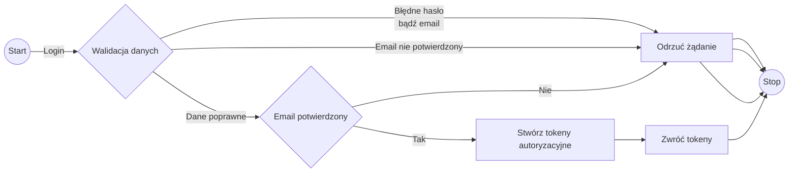
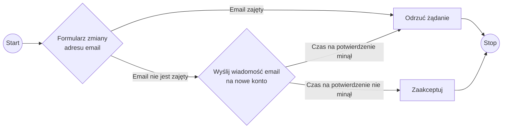
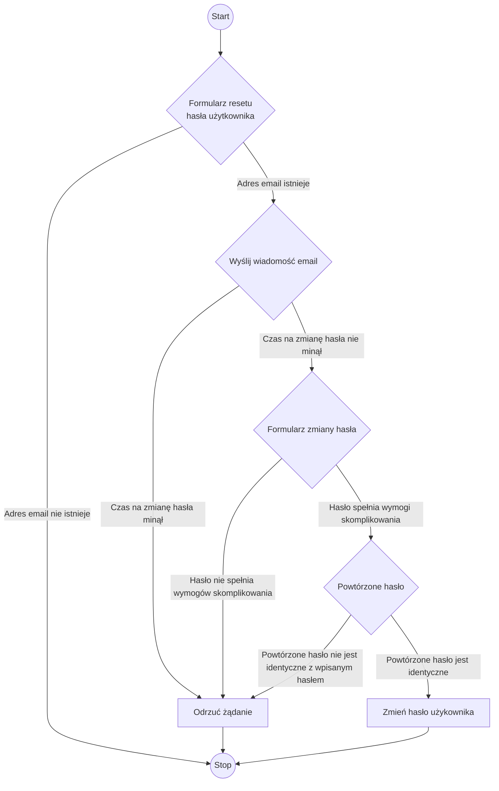
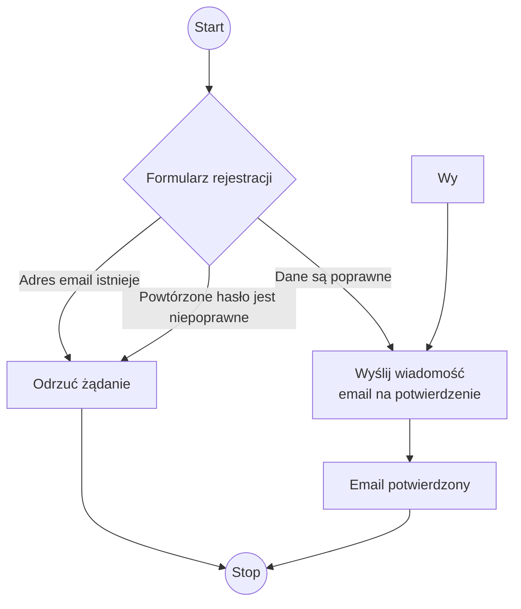
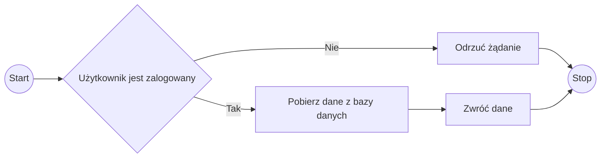

Diagram sekwencji logowania

Diagram sekwencji zmiany adresu email

Diagram sekwencji resetu hasła

Diagram sekwencji rejestracji użytkownika

Diagram sekwencji pobierania danych o śmietnikacz

